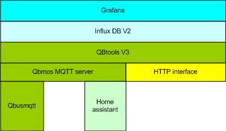

# qbtools-V3.1.1.2

For changes see release notes

The way you install v3 is different from v2.
Instead of installing the environment from a tar file with precustomized softwares, version 3 is installed via definitions in a docker-compose.yaml file.
Qbtools v3 is a collection of 3 docker images. Together they interface QBUS, Homeassistant, Influxdb & Grafana and http.
Prerequisites are docker and docker-compose.

Qbtools-v2 was difficult to upgrade due to a possible mix of qbtools code and user code. For this reason, qbtools-v3 is no longer exposed. You'll need to setup a second nodered server with your own automation scripts and other interfaces. This way, qbtool's code and your code is clearly separated.

                 

 

<br/>


<br/>
--activated-red)





## Docker images 
- ### <a href="https://hub.docker.com/r/wk275/qbmos">wk275/qbmos</a>
qbmos is a customized mosquitto server. 

Instead of defining a user and password via the standard mosquitto tools, you can directly define them via the docker-compose.yaml environment variables MQTT_USER and MQTT_PASSWORD.

- ### <a href="https://hub.docker.com/r/wk275/qbusmqtt">wk275/qbusmqtt</a>
qbusmqtt is a docker image for the Qbus mqtt gateway. (for details about the default qbusmqttgw installation see https://github.com/QbusKoen/QbusMqtt-installer)

- ### <a href="https://hub.docker.com/r/wk275/qbtools">wk275/qbtools</a>
qbTools is the interface between Qbus, Homeassistant, InfluxDB database & Grafana statistics

## Qbtools features:
  ##### HAparms.Ha.regexPre is no longer supported. You should use HAparms.qbusHA.entities instead !!!
  
  ### Create Home assistant entities:

  Home assistant entities are created automatically for Qbus outputs. This process is based upon a MQTT server and Home assistant discovery. Root topic is homeassistant.

  Qbtools rely on a unique qbus output name. So if duplicates, please correct them first in qbus system manager.
    
  Following qbus outputs types and HA entity types are supported.
  
  |Qbus output type|Home Assistant entity type|
  |----------------|--------------------------|
  |Dimmer          | Light|
  |On/Off          | Switch|
  |Shutter         | Cover|
  |Thermostat      | Climate (heating only)|
  |Scene           | Scene|
  |Gauge           | Sensor|
  |Stepper         | Number|

  ### Create extra HA entities 
  via the ~/qbtools-v3/HA_parms/HAparms.js file - section qbusHA.entities. You'll find an example file in this directory after starting the qbtools container. Just rename is to HAparms.js and modify its contents. When saved, the parameters will be picked up by qbtools and the extra HA entities will be created after a short period.

  e.g.
  - create a HA binary_sensor for qbus switch (e.g a garage_door security switch)
  - create a HA sensor for a qbus thermostat
  - For details see definitions below.
  
        "qbusHa": {
            "entities": [
                          { "name_regex": "^Virtual_Binary_sensor1$",     
                            "Virtual_Binary_sensor1"
                            "attributes":
                                {
                                    "entity_type": "binary_sensor",
                                    "device_class": "garage_door",
                                    "payload_on": true, 
                                    "payload_off": false
                                },
                          },
                          { "name_regex": "^Virtual_HVAC_Therm$",
                            "attributes":
                              {                                              
                                  "entity_type": "sensor",
                                  "icon": "mdi:thermometer"
                              },
                          },
                    ],
                }
      
       
  ### Modify HA entities before creation:
  You can modify almost every HA entity property before it is sent to the HA MQTT discovery topic homeassistant.
  This is also done via the HAparms.js file in section ha.regexPost. You'll find an example file in the HA_parms directory after starting the qbtools container.
  Just rename is to HAparms.js and modify its contents. When saved, the parameters will be picked up by qbtools and the correspondening HA entities will be modified after a short period.
  <br/>For details see definitions below.

      "ha": {
        "regexPost": [
            {
                "name_regex": "Virtual_HVAC_Therm.currRegime",
                "attributes":
                {
                    "icon": "mdi:clipboard-list-outline",
                }
            },
            {
                "name_regex": "Virtual_HVAC_Therm.setTemp",
                "attributes":
                {
                    "icon": "mdi:home-thermometer",
                }
            },
            {
                "name_regex": "Virtual_HVAC_Therm.currTemp",
                "attributes":
                {
                    "icon": "mdi:temperature-celsius",
                }
            },
            {
                "name_regex": "_Blinds_",
                "attributes":
                    { "device_class": "shutter" }
            },
            {
                "name_regex": "_Power_",
                "attributes":
                    { "icon": "mdi:power-socket-eu" }
            },
            {
                "name_regex": "shellyplug",
                "attributes":
                    { "icon": "mdi:power-plug" }
            },
            {
                "name_regex": ".*",
                "attributes":
                    { "device.identifiers": "[@location]",
                      "device.name": "[@location]",
                      "device.manufacturer": "QBUS",
                      "device.model": "Qbus"
                    }
            }
        ]
      }


- In the HAparms sections following statements are allowed:
  
  - "[@value]" refers to another entity or qbus property,
    e.g. "name": "[@unique_id]" means: if "name" parameter is not defined, it will get the value of the "unique_id" parameter.
  - "[@value#slice(split character, join character, start offset, end offset)]" refers to another parameter and does some slice processing on it, e.g,
         
         ```
        {
            "topic": "cloudapp/QBUSMQTTGW/UL1/UL49/setState",
            "entity_type": "sensor",
            "name": "test_[@topic#slice(/,_,2,4)]-[@entity_type]",
        },
     
        results in "name": "test_UL1_UL49-sensor"

        ```
### HTTP interface:
  
  qbtools has an integrated HTTP server. It has 2 methods: qbusGet and qbusSet and it's parameters should be specified as a flat object. 
  <br/>E.g
  
    default qbus mqtt object:
      {
          "id":"UL106",
          "properties":
            {
              "currTemp":28
            },
          "type":"event"
        }
  
    flat object:
        {  "id": "UL106",
            "properties.currtemp" = 28,
           "type":"event
        }
  
  ### qbusGet

    http://<ipaddress of qbtools server>:<qbtools port>/qbusGet?topic=Virtual_HVAC_Therm     

        ==> response
        {
          "topic": "cloudapp/QBUSMQTTGW/UL1/UL167/state",
          "qos": 1,
          "retain": false,
          "_msgid": "0285c33dcf41b1a7",
          "payload": {
            "id": "UL167",
            "properties.currRegime": "COMFORT",
            "properties.currTemp": 30,
            "properties.setTemp": 22,
            "type": "state"
          }
        }
  

  ### qbusSet

    http://<ipaddress of qbtoolsserver>:<qbtools port>/qbusSet?topic=Virtual_HVAC_Therm&payload.currRegime=NACHT
        ===> response
        {
          "topic": "cloudapp/QBUSMQTTGW/UL1/UL167/setState",
          "retain": false,
          "qos": 0,
          "payload": {
            "id": "UL167",
            "type": "state",
            "properties": {
              "currRegime": "NACHT"
            }
          },
          "_msgid": "6c22415b7899182a"
        }
          
## How to install a complete qbtools environment from scratch:
- Open a login session on your server and execute code below.
It will 
  - create a directoy qbtools-v3 in your home-directory
  - create a docker-compose.yaml file in this directory
  - start-up docker containers

- #### Please choose your own user names and passwords and modify all MQTT_USER and MQTT_PASSWORD environment variables conform !

````
mkdir ~/qbtools-v3
cd ~/qbtools-v3
cat > docker-compose.yaml << EOF
services:
  qbmos:
    image: wk275/qbmos:latest
    environment:
      - TZ=Europe/Brussels
      - MQTT_USER=appmos                                        ## qbmos mosquitto user
      - MQTT_PASSWORD=NCJDeceoXZBUCBZib28EZD9yxshxzoç2703E      ## qbmos mosquitto password
    container_name: qbmos-v3
    restart: unless-stopped
    ports:
      - "51883:1883"
    volumes:
      - ./mosquitto/data:/mosquitto/data

  qbusmqtt:
    image: wk275/qbusmqtt:latest
    container_name: qbusmqtt-v3
    restart: unless-stopped
    network_mode: host
    environment:
      - TZ=Europe/Brussels
      - MQTT_HOST=0.0.0.0
      - MQTT_PORT=51883
      - MQTT_USER=appmos                                        ## qbmos mosquitto user
      - MQTT_PASSWORD=NCJDeceoXZBUCBZib28EZD9yxshxzoç2703E      ## qbmos mosquitto password

  qbtools:
    image: wk275/qbtools:latest
    container_name: qbtools-v3
    restart: unless-stopped
    environment:
      - TZ=Europe/Brussels
      - MQTT_HOST=qbmos
      - MQTT_PORT=1883
      - MQTT_USER=appmos                                        ## qbmos mosquitto user
      - MQTT_PASSWORD=NCJDeceoXZBUCBZib28EZD9yxshxzoç2703E      ## qbmos mosquitto password
      - INFLUXDB2_URL=http://influxdbV2:8086
      - INFLUXDB2_ORG=                                          ## fill in after setup of influxdb
      - INFLUXDB2_BUCKET=                                       ## fill in after setup of influxdb
      - INFLUXDB2_TOKEN=                                        ## fill in after setup of influxdb
    ports:
      - "51881:1880"
    volumes:
      - ./HA_parms:/HA_parms

  homeassistant:
    image: ghcr.io/home-assistant/home-assistant:latest
    container_name: homeassistant-v3
    restart: unless-stopped
    environment:
      - TZ=Europe/Brussels
    ports:
      - "58123:8123"
    volumes:
      - "./homeassistant/config:/config"
      - "./homeassistant/local:/.local"

  influxdbV2:
    depends_on:
      - qbmos
    image: influxdb:latest
    container_name: influxdbV2-v3
    restart: unless-stopped
    ports:
      - "58086:8086"
    volumes:
      - ./influxdbV2/data:/var/lib/influxdb2
      - ./influxdbV2/etc:/etc/influxdb2
    environment:
      - TZ=Europe/Brussels

EOF
docker compose up -d
````
### log files
Just type docker logs "container-id" -f
````
docker logs qbtools-v3 -f
````

### Home assistant customization:
  - Login to Home assistant on http://homeassistant_server_ip_address:58123
  - After setup go to Setup > Devices and services > Add integration
  - Add MQTT with following parameters (be sure to specify MQTT exactly, not MQTT JSON,...)
    - Broker = qbmos
    - Port = 1883
    - User name = appmos                               or your user if changed
    - Password =  NCJDeceoXZBUCBZib28EZD9yxshxzoç2703E or your password if changed
  - Hit send & complete

- #### Restart your home assistant.<br/> After a while you'll see all your qbus outputs in the HA overview

### InfluxDB v2 customization:
  - Login to InfluxDB on http://<Influxdb server ip address>:58086
  - Hit button "get started"
  - Fill in following items
    - username: choose one
    - password: choose one & remember it :-)
    - confirm password: same as password
    - initial organization name: e.g nodered
    - initial bucket name: init_bucket
  - Hit continue & configure later
  - go to API tokens and hit generate API TOKEN > All Access API Token
    - choose a name e.g. qbus
    - hit save
    - copy the token via < CNTRL C > and not via button COPY TO CLIPBOARD
    - close window
  - go to buckets
    - hit button create bucket
    - name e.g. qbus
    - hit create 

  - copy above parameters: organization, bucket and token to the specific environment variables in the docker-compose.yaml file in the container section qbtools! Be sure that you do not use quotes or a space before or behind the equal sign!
  - #### restart all docker containers ! After the restart everything should be working.
  - #### Check qbmos, qbusmqtt and qbtools container log files if you have problems starting up the environment

## if you want to use your MQTT server.
  <br/> Just define in the docker-compose the sections qbusmqtt and qbtools and modify the MQTT_* environment variables conform your environment setup.

## Do not use other qbusmqtt docker images than wk275/qbusmqtt
They may contain other binary versions of the qbusmqttgw which are not compliant with qbtools V3.1.1.2

## Issues and enhancements:
Please use the issues tab on this git-hub. I will look into it asap.

## How to upgrade
Because all components use a container based approach it will be very easy to upgrade.
- Bring down your containers
  ````
  cd ~/qbtools-v3
  docker compose rm --stop --force
  ````
- Remove qbtools, qbmos and qbusmqtt images
  ````
  docker images -a
  docker rmi wk275/qbtools wk275/qbmos wk275/qbusmqtt
  docker system prune <<<y
  ````
- do not delete the directories under qbtools-v3, but start the containers again 
````
docker compose up -d
````


# Remarks
⚠️ wk275/qbtools, wk275/qbmos & wk275/qbusmqtt are not officially supported by Qbus.
